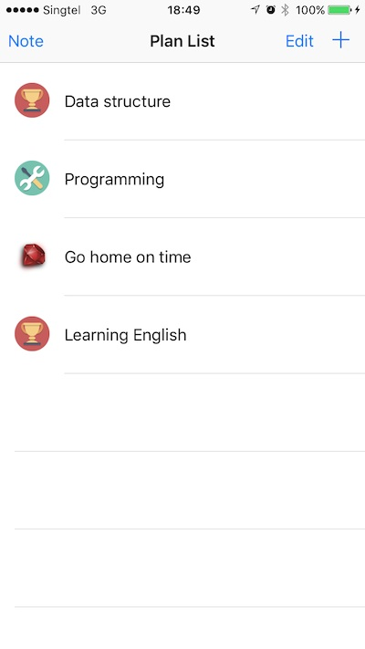
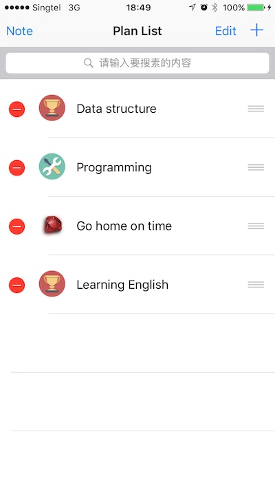
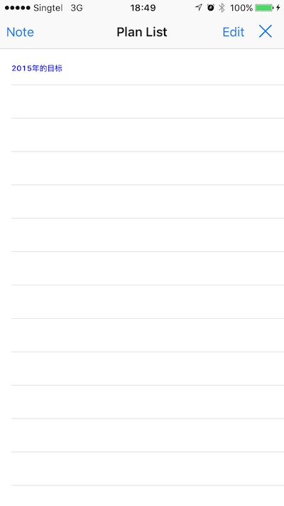
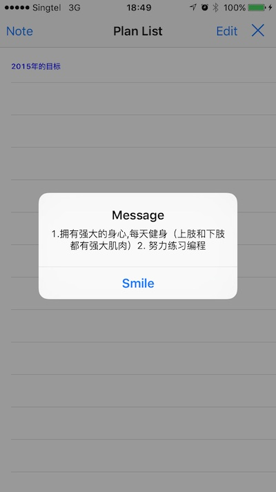
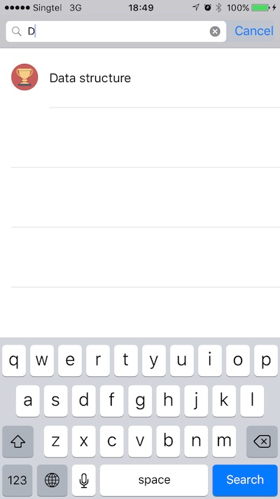
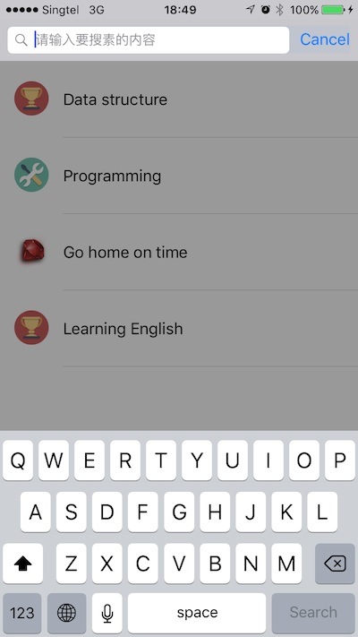
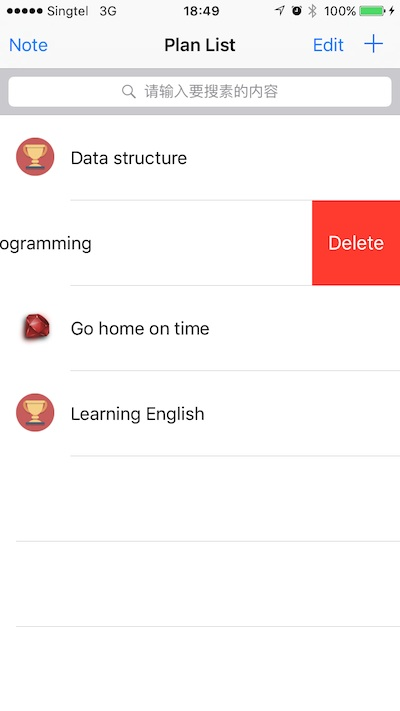
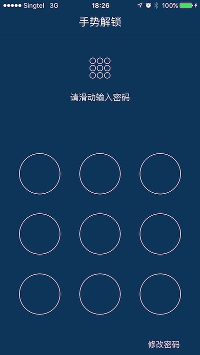

# PlanList

Developed by Tony Cao

This is a simple app for myself to manage daily tasks I need to finish. I used a plugin to add the passcode functions into the app for protecting the list I write. And the whole list's data will be saved into the cache file in the phone so it can be reloaded if you restart the app.

UI screenshots:

 

 

 

 

 

 
 
 